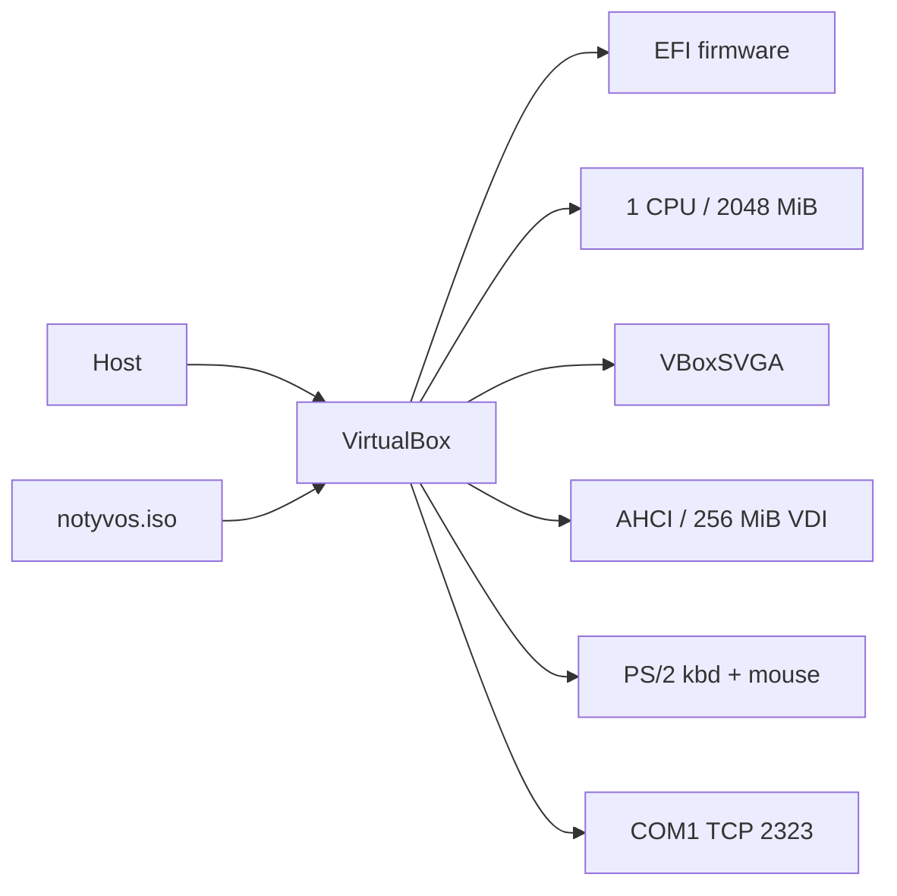

# NOTYVOS Virtual Machine Testing

NOTYVOS is currently developed and tested in VirtualBox.

## VM topology



```d2
direction: right
Host -> VirtualBox
VirtualBox -> Guest: EFI + VBoxSVGA + AHCI
ISO -> VirtualBox: attach
Guest -> Serial: COM1 :2323
```

## Current VM configuration

The repository setup script creates a development VM with:

| Setting | Value |
|---|---|
| VM name | NotYVOS |
| Firmware | EFI |
| CPUs | 1 |
| Memory | 2048 MiB |
| VRAM | 64 MiB |
| Graphics | VBoxSVGA |
| 3D acceleration | Off |
| Chipset | PIIX3 |
| I/O APIC | Off |
| HPET | On |
| Long mode | On |
| Nested paging | On |
| Keyboard | PS/2 |
| Mouse | PS/2 |
| USB | Off |
| Audio | Off |
| COM1 | 0x3F8, IRQ4 |
| Serial | TCP server, port 2323 |
| Storage | SATA / Intel AHCI |
| VM disk | 256 MiB VDI |

This is a development configuration. SMP and the current PS/2, storage,
graphics and audio initialization are already implemented. USB support is implemented in the kernel, including xHCI, HID and MSC, but the current VM configuration keeps USB off. RTL8188EU Wi-Fi firmware is supplied from `Firmware/rtl8188eufw.bin` for physical-hardware development; VirtualBox does not provide the RTL8188EU hardware path. Bluetooth remains queued in Phase 18.

## Why I/O APIC is off

The current timer and keyboard path uses the legacy 8259 PIC. The VM is
therefore configured with I/O APIC disabled so the expected PIC interrupt
routing remains available.

## Setup scripts

All VM scripts are under tools/scripts/.

### vbox-setup.cmd

Creates the NotYVOS VM, virtual disk, SATA controller, ISO attachment, EFI
configuration, PS/2 devices and serial console.

Run for a fresh VM:

    tools\scripts\vbox-setup.cmd

Warning: the script unregisters and deletes an existing VM with the same
name.

### vbox-run.cmd

Powers off the VM if necessary, reattaches the latest Release ISO, starts
the VM and connects the serial console.

    tools\scripts\vbox-run.cmd

### vbox-restart.cmd

Restarts the VM and reattaches the ISO without being the full serial-console
wrapper.

### vbox-serial.ps1

Connects to COM1 through the TCP serial endpoint on port 2323 and forwards
input to the guest.

## Daily workflow

1. Build the Release preset.
2. Run tools/scripts/vbox-run.cmd.
3. Wait for the desktop and shell.
4. Run the smoke tests in docs/testing.md.
5. Inspect serial logs for warnings and errors.
6. Rebuild after source changes.

## Input

The guest accepts PS/2 keyboard and mouse input. The serial console also
provides an input path for shell testing.

If PS/2 input fails:
1. confirm I/O APIC is disabled,
2. confirm PS/2 devices are enabled,
3. click inside the VM window,
4. use the serial console as a fallback.

## Black screen

Check the VBoxSVGA graphics controller and inspect the serial console. Kernel
logging remains available through COM1 even when framebuffer output is not
visible.

## ISO errors

Rebuild the selected CMake preset and verify that the generated notyvos.iso
exists in that preset's build directory before running the VM.

## Serial console

COM1 is exposed as TCP port 2323. A standalone connection can be started
with:

    pwsh -NoProfile -ExecutionPolicy Bypass -File .\tools\scripts\vbox-serial.ps1

The current active roadmap milestone is init-program debugging after the delivered Phase 11, Phase 12, Phase 13A and Phase 15A–15E work. VirtualBox is a host-side testing dependency. It is not part of the NOTYVOS
kernel or OS distribution.
