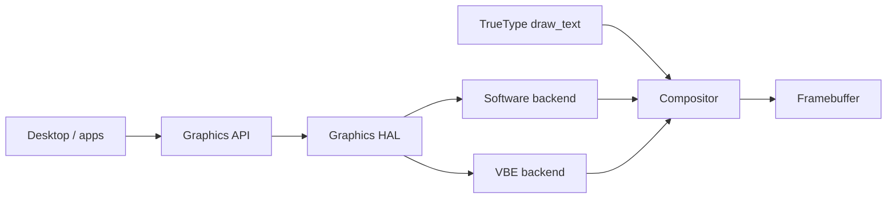
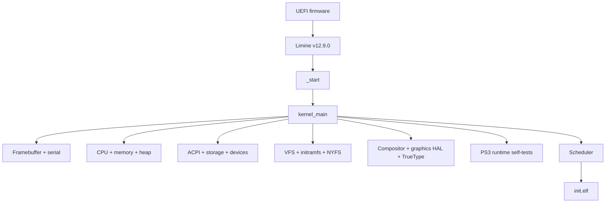

# NOTYVOS Architecture

## Current state

NOTYVOS is a freestanding x86-64 kernel with user-mode processes, a VFS,
persistent NYFS storage, a software-rendered desktop, native device drivers,
and a PS3 runtime foundation.

The repository contains the delivered Phase 0–10F foundation plus Phase 11 TrueType rendering, Phase 12 Explorer/file operations, Phase 13A clipboard and Phase 15A–15E USB + unified input. User-fault isolation and related build/test hardening are also delivered. The current engineering milestone is init-program debugging.

### Windows compatibility domain

Windows compatibility is reserved for later compatibility phases. The repository does
not currently provide a Windows PE/Win32 compatibility runtime.

## Memory and processes

The kernel uses four-level x86-64 paging and a higher-half kernel. User
programs receive their own PML4 with the kernel higher-half mappings shared
into the upper half.

The ELF loader:
1. validates ELF64/x86-64 input,
2. loads PT_LOAD segments into newly allocated user pages,
3. creates a user stack,
4. records the user address range,
5. returns the process CR3 and entry/stack addresses.

fork clones the user-visible mapped pages into a new address space.
Processes maintain parent/child links, file tables, current working
directory state, exit status and reaping state.

## Syscalls and user access

The syscall entry path is implemented in x86-64 assembly and dispatched by
the kernel. Current user-facing operations include process control, file
operations, directory enumeration, anonymous mapping, execution, heap
extension, time/sleep, signal/termination, and NYFS file creation/removal.

User pointers are handled through the kernel uaccess layer rather than being
trusted directly.

## Filesystems

The VFS provides a VNode-based namespace and file-descriptor layer.

The initramfs is a ustar archive loaded by Limine and mounted at /. NYFS is a
persistent block-backed filesystem mounted at /disk.

NYFS currently stores:
- one 512-byte superblock
- a fixed 64-entry file table
- file data sectors following the metadata area

It supports file creation, reading, writing, directory enumeration and
unlink. It is intentionally a small development filesystem, not yet a
general-purpose journaling filesystem.

## Graphics stack

The graphics stack has four layers:

1. Graphics API — device-independent drawing primitives.
2. HAL — backend registration and common rendering surface.
3. GPU abstraction — triangle, quad, line and rectangle primitives.
4. Compositor — desktop scene, windows, widgets, input and presentation.



The native desktop rendering path uses the Graphics API/HAL/backend architecture,
while the PS3 runtime additionally has a software RSX compatibility path with
FIFO command processing, rasterization, vertex/index buffers, depth/scissor
state, smooth shading, texture binding, UVs, perspective correction, wrapping
and mipmap/LOD sampling.

The compositor currently provides:
- desktop background and optional wallpaper.raw
- taskbar and Start menu
- desktop shortcuts
- window focus and dragging
- Alt-Tab switching, minimize/restore animation and Alt+F4 handling
- taskbar hover feedback, grouped windows, snap layouts and notification toasts
- minimize/maximize/close state
- terminal, Explorer, Settings and Bin windows
- context menu
- PS/2 mouse cursor

The widget layer currently contains Button, Label and ListView primitives.

The UI text path now uses the delivered Phase 11 TrueType subsystem. Inter is parsed, rasterized and cached with anti-aliased text output. Multiple weights, kerning and complex-script shaping remain deferred.

## Native devices

Implemented driver/domain code includes:
- ACPI table discovery and power control
- AHCI block storage
- Intel e1000 network device detection/initialization
- HDA audio initialization
- PS/2 keyboard and mouse
- LAPIC/per-CPU/SMP infrastructure

Wi-Fi, Bluetooth, USB HID and a production network
stack are not currently implemented.

## PS3 translation architecture

The PS3 PPU state is represented by a register context containing GPR/FPR
state, PC, LR, CTR, XER and CR plus memory/syscall callbacks.

The baseline JIT:
1. looks up the current PPC PC in the translation cache
2. translates a supported basic block when absent
3. emits x86-64 machine code into executable memory
4. enters it through the x86-64 JIT trampoline
5. falls back to the PPU interpreter for unsupported instructions and the
   current syscall boundary

The translation cache records blocks, hits/misses and memory usage. Phase 5A–5D
provides the completed native translation path, including broader memory and
control-flow translation, FPU/VMX translation, block chaining and cache
invalidation/self-modifying-code handling.

## Boot architecture



```d2
direction: down
UEFI -> Limine: boot
Limine -> Start: "_start"
Start -> Main: kernel_main
Main -> FB: framebuffer + serial
Main -> CPU: CPU + memory + heap
Main -> Devices: ACPI + storage
Main -> VFS: initramfs + NYFS
Main -> Desktop: compositor + TrueType
Main -> PS3: runtime self-tests
Main -> Scheduler
Scheduler -> Init: init.elf
```

## Important boundaries

- Sony PS3 firmware is user-supplied and isolated to the PS3 runtime.
- NotYVFirm is a separate native firmware domain and is not the PS3 firmware.
- No Sony private keys or decryption bypasses are included.
- Windows compatibility is not currently implemented.
- Brave and VLC installers under Inbuilt Devices/ are application packages,
  not kernel components.


## Image and theme domains

Phase 9A–9C provide BMP, PNG, GIF, ICO and JPEG decoding and the Image Viewer application. The current image path is:

```text
VFS file
   ↓
BMP decoder
   ↓
decoded pixel buffer
   ↓
Image Viewer
   ↓
Graphics API
   ↓
Compositor
   ↓
framebuffer
```

Phase 10A provides Dark, Light and macOS Dark themes plus shortcut integration.
Phase 10F exposes Appearance controls through Settings and feeds the active
theme into the desktop UI styling layer.

## Current roadmap boundary

Implemented and frozen:

**Phases 0–10F**

Phase 11 TrueType rendering is delivered. The active next milestone is Phase
12A, Explorer grid view and details toggle. Phase 12 continues with breadcrumb
navigation and real file operations, followed by the queued desktop, GameRunner,
USB, networking, Wi-Fi, Bluetooth, NYFS, firewall and firmware phases.

Windows PE/Win32 compatibility and Brave/VLC validation are explicitly excluded
from the current roadmap.

## Architecture visualization sources

Canonical facts remain this document and `docs/roadmap.md`. Visualization
sources live in [`docs/diagrams/`](diagrams/README.md).

| Source | Tool | Renders on GitHub |
|---|---|---|
| Mermaid in this file | Mermaid | Yes |
| `diagrams/roadmap.markmap.md` | Markmap | As Markdown outline |
| `diagrams/architecture.d2` | D2 | Source only |
| `diagrams/architecture.ilograph.yaml` | Ilograph | Source only |
| `diagrams/architecture.eraser.md` | Eraser | Source only |
| `diagrams/architecture.excalidraw.md` | Excalidraw | Source only |
| `diagrams/architecture-graph.html` | Cytoscape.js | Open the HTML |
| `diagrams/architecture.gojs.html` | GoJS | Open the HTML |
| `diagrams/host-infrastructure.py` | Python Diagrams | Generate PNG/SVG |

### System layer map (Markmap source)

- NOTYVOS
  - Boot
    - UEFI firmware
    - Limine v12.9.0
    - `_start` / `kernel_main`
  - Kernel
    - CPU / GDT / TSS / SMP
    - PMM / VMM / heap
    - Scheduler / syscalls
    - VFS / initramfs / NYFS
  - Desktop
    - Graphics API / HAL
    - Compositor / widgets
    - TrueType / Inter
    - Explorer / Settings
  - PS3 runtime
    - ELF loader / ABI
    - PPU interpreter + JIT
    - SPU / DMA
    - RSX software path
    - GameRunner
  - Next
    - Phase 12 Explorer 10G

```ilograph
# Valid Ilograph excerpt. Full multi-perspective file:
# docs/diagrams/architecture.ilograph.yaml
resources:
  - name: Kernel
    children:
      - name: VFS
      - name: NYFS
      - name: Compositor
      - name: TrueType
      - name: PS3 Runtime
perspectives:
  - name: System
    relations:
      - from: VFS
        to: NYFS
        label: /disk
      - from: TrueType
        to: Compositor
        label: font::draw_text
      - from: Compositor
        to: VFS
        label: desktop I/O
```
