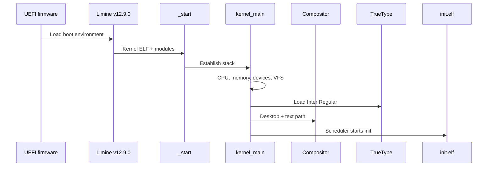

# NOTYVOS Boot Flow

## Current boot sequence



```d2
direction: down
UEFI -> Limine: firmware handoff
Limine -> Kernel: ELF + initramfs + requests
Kernel -> Desktop: compositor + TrueType
Kernel -> Userland: init.elf
```

1. UEFI firmware loads the Limine boot environment.
2. Limine loads the NOTYVOS kernel ELF and configured user modules.
3. Limine provides framebuffer, memory-map, HHDM, SMP/MP, module and RSDP
   information through its request protocol.
4. _start establishes the kernel entry stack and calls kernel_main.
5. kernel_main initializes serial output, framebuffer console and logging.
6. CPU and memory subsystems initialize: CPU features, physical memory,
   virtual memory, kernel heap and executable memory arena.
7. CPU/RTC, ACPI, AHCI block storage, e1000 networking, HDA audio, per-CPU/LAPIC
   and SMP support are initialized.
8. NYFS is mounted on the first available block device. If its superblock is
   absent, the development filesystem is formatted.
9. The Limine initramfs module is parsed as a ustar archive and mounted at /.
   NYFS is attached as /disk.
10. The graphics compositor starts and switches the framebuffer console to
    buffered desktop rendering.
11. Software and VBE graphics backends are registered and the graphics
    device is initialized.
12. The PS3 runtime initializes its translation cache and RSX state, then runs
    decoder, ELF, PPU, SPU, DMA, JIT and RSX self-tests.
13. The scheduler initializes.
14. init.elf is loaded as an x86-64 user process with its own address space
    and user stack.
15. Interrupts are enabled and the scheduler starts init.
16. The user shell becomes the primary interactive userland process.

## Current boot modules

The ISO currently supplies:
- notyvos-kernel.elf
- init.elf
- initramfs.tar

The initramfs contains the current user test program and text files. An
optional converted wallpaper is also included when Wallpaper/1.png or a
pre-converted raw wallpaper is present.

## Boot boundary

Phases **0–10F are frozen as delivered**. Phase 11 TrueType rendering is now
delivered as part of the desktop text path. The active roadmap begins with
Phase 12A, Explorer grid view and details toggle.

The current boot path still uses Limine. Native firmware replacement is a
separate long-term Phase 21 project and is not yet implemented.

## Current runtime additions

After the kernel/userland foundation, the repository contains the delivered
RSX path through 6F, GameRunner through 7C, rendering validation through 8B,
image support through 9C, desktop polish through 10F and the TrueType font
subsystem through 11E.

Phase 12 is the next user-visible work. It covers Explorer 10G and real file
operations. Phase 14 later covers the 7D GameRunner session lifecycle.

## Firmware separation

The native PC boot path does not depend on Sony PS3 firmware. PS3 firmware,
when required by runtime stages, belongs exclusively to the PS3 runtime domain.
NotYVFirm is a future native firmware project tracked as Phase 21.
