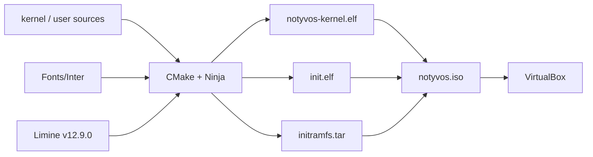

# Build

## Prerequisites

- Clang/LLVM 17+
- LLD 17+
- CMake 3.25+
- Ninja 1.11+
- xorriso
- tar
- Visual Studio Community may be used as the IDE
- VirtualBox for the documented VM workflow

The kernel is a freestanding Clang/LLVM target. Visual Studio is not the
kernel compiler.

## Fetch Limine

From the repository root:

    pwsh tools/scripts/fetch_limine.ps1

or:

    bash tools/scripts/fetch_limine.sh

The scripts populate:

    third_party/limine/
    ├── limine-12.9.0/
    └── limine-binary/

## Build data flow



```d2
direction: right
Sources -> CMake: Clang/LLD
Inter -> CMake: bundled TTF
Limine -> CMake: boot files
CMake -> ISO: notyvos.iso
ISO -> VirtualBox
```

Host-side Python Diagrams source: [`diagrams/host-infrastructure.py`](diagrams/host-infrastructure.py).

## Configure and build

### Windows

Debug:

    cmake --preset windows-clang-kernel-debug
    cmake --build --preset build-kernel-debug

Release:

    cmake --preset windows-clang-kernel-release
    cmake --build --preset build-kernel-release

### Linux

Debug:

    cmake --preset linux-clang-kernel-debug
    cmake --build --preset build-kernel-debug-linux

Release:

    cmake --preset linux-clang-kernel-release
    cmake --build --preset build-kernel-release-linux

The kernel build also builds the freestanding init.elf and hello.elf,
creates initramfs.tar, and produces notyvos.iso.

## Build outputs

A typical preset build directory contains:

    build/
    └── kernel-<preset>/
        ├── notyvos-kernel.elf
        ├── init.elf
        ├── initramfs.tar
        └── notyvos.iso

The exact directory name is determined by the selected CMake preset.

## Wallpaper conversion

If Wallpaper/1.png exists, the build can convert it to wallpaper.raw
using tools/scripts/convert-wallpaper.ps1.

The converter limits the generated image to a maximum width of 1920 pixels
while preserving aspect ratio. convert-wallpaper.sh provides the matching
host-side conversion path.

The kernel image subsystem decodes BMP, PNG, GIF, ICO and JPEG data. The Phase 11 TrueType renderer also consumes the bundled Inter font family. Wallpaper conversion remains an optional host-side raw-wallpaper path.

## Running

The current documented VM runner is VirtualBox:

    tools\scripts\vbox-setup.cmd
    tools\scripts\vbox-run.cmd

vbox-setup.cmd creates/configures the VM once. vbox-run.cmd powers off any
running instance, reattaches the latest ISO, starts the VM and connects the
COM1 serial console.

QEMU is no longer part of the active test workflow. The remaining
tools/qemu/ files are retained as boot configuration data.

## Roadmap-aware build boundary

The current build targets the delivered Phases 0–10F plus Phase 11 TrueType
font subsystem. Phase 12 Explorer work is the next source milestone. The build
system does not include Windows PE/Win32 compatibility or Brave/VLC validation.

## Limine

The repository pins Limine to v12.9.0. The fetched tree provides the Limine
header and boot images required by the ISO build.
