# NOTYVOS Data Flow

This document maps the data and control flow of the **implemented and
currently active NOTYVOS phases**. It is intentionally based on the current
repository implementation rather than future interfaces.

> **Diagram note:** the diagrams use Mermaid flow and sequence notation.
> GitHub renders them as interactive diagrams in supported Markdown views.
> The sequence diagrams provide an animation-like time progression from input
> to output. They are not intended to claim hardware acceleration or runtime
> behavior that has not been implemented.

## System-wide flow

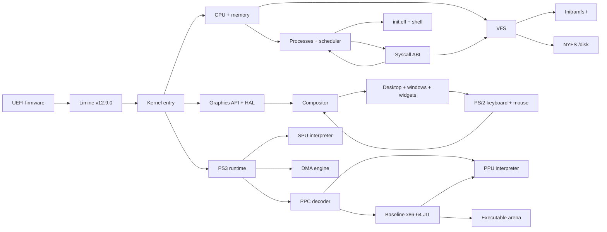

## Phase 1 — Kernel Core

### 1A — CPU initialization, GDT, TSS, serial and framebuffer

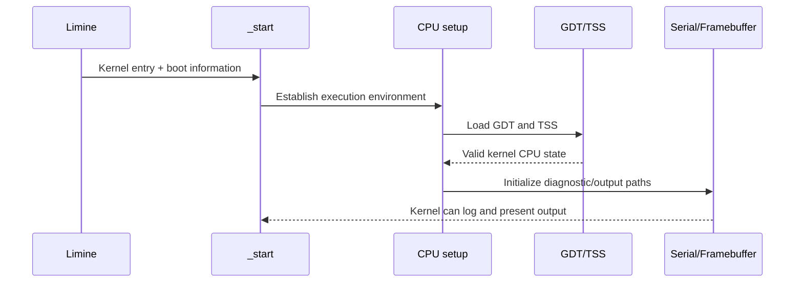

### 1B — IDT, ISR stubs, exceptions, PIC and PIT

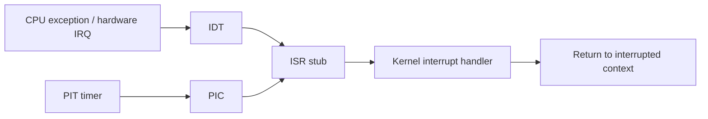

### 1C — Physical memory manager

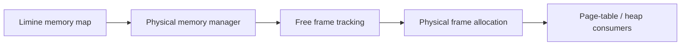

### 1D — Virtual memory and HHDM

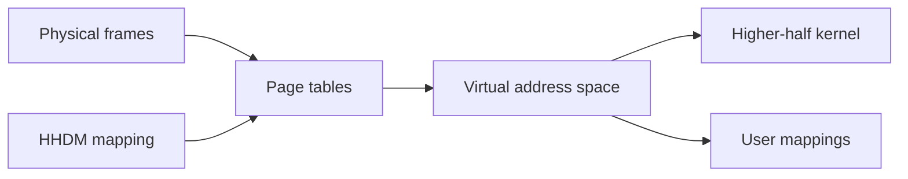

### 1E — Kernel heap

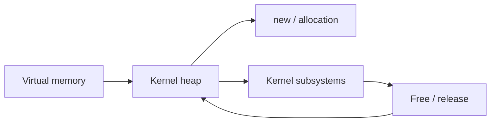

### 1F — Logging, panic and assertions

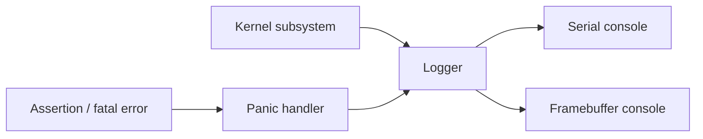

### 1G — Per-CPU state, LAPIC and SMP bring-up

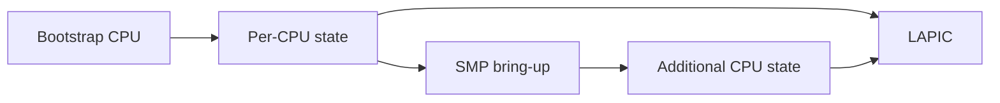

## Phase 2 — Processes, Syscalls, VFS and Userland

### 2A — Ring 3 transition

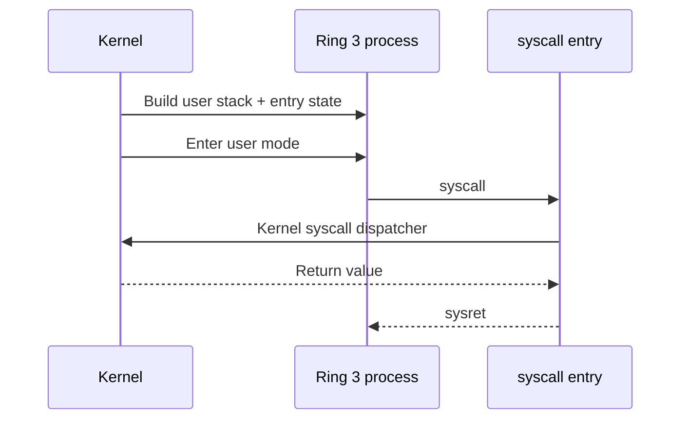

### 2B — Scheduler + threads

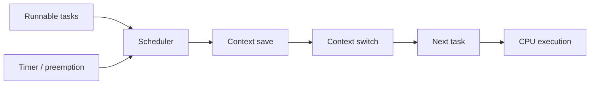

### 2C — Processes + ELF loader

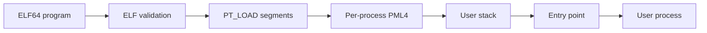

### 2C-followup — fork / wait

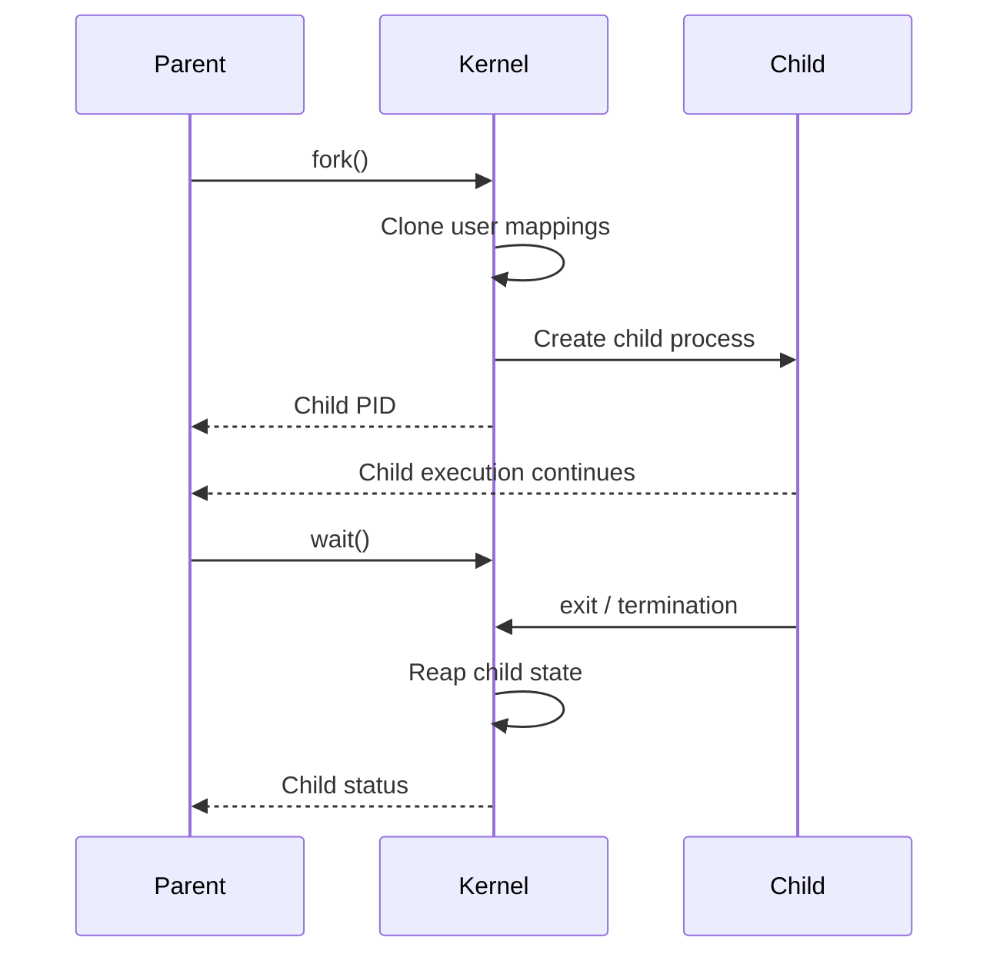

### 2D — Syscall ABI + uaccess

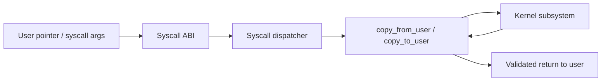

### 2D-followup — readdir / mmap

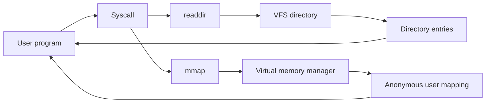

### 2E — VFS


### 2F — Initramfs

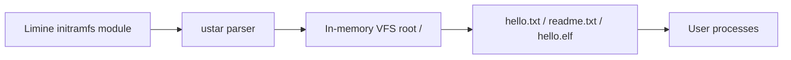

### 2G — libc + shell

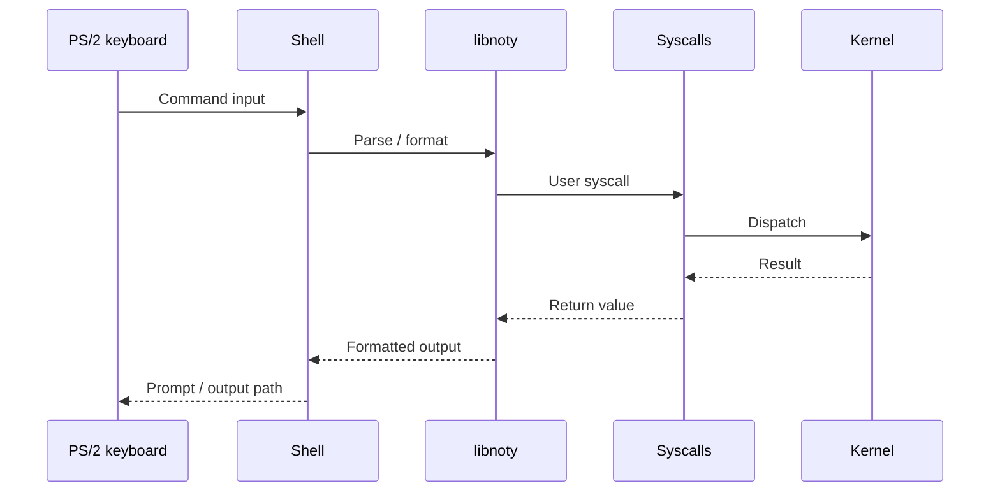

### 2I — exec / brk

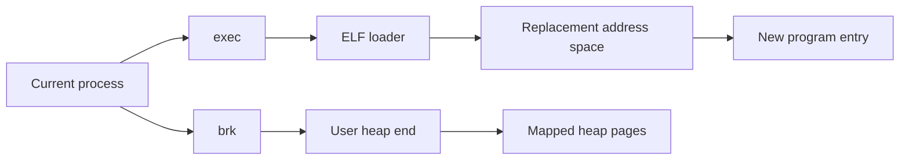

### 2K — Persistent FS (NYFS)

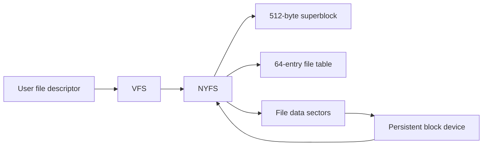

### 2L — Time / sleep / kill

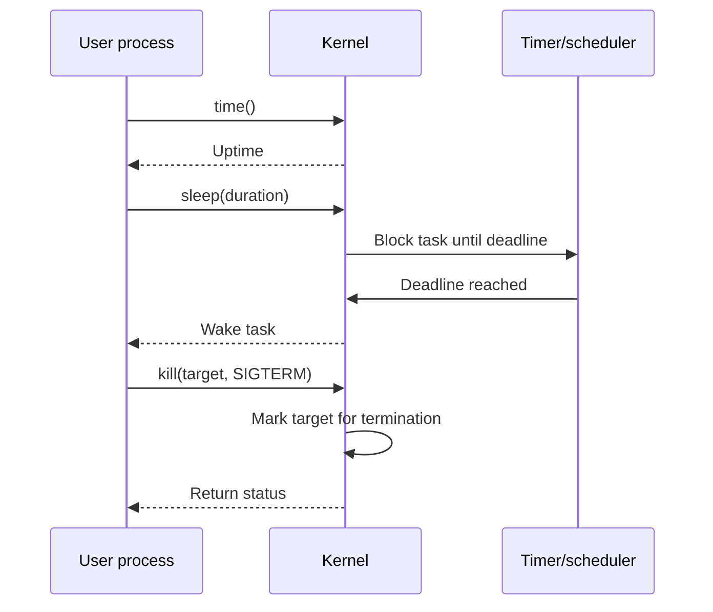

### 2M — stdio + malloc

```mermaid
flowchart LR
    APP[User program] --> STDIO[libnoty stdio]
    STDIO --> FD[File descriptor syscalls]
    FD --> VFS[VFS / NYFS]
    APP --> MALLOC[malloc]
    MALLOC --> HEAP[User heap]
    HEAP --> BRK[brk / memory mapping]
```

### 2N — Signals + Ctrl+C

```mermaid
sequenceDiagram
    participant KB as PS/2 keyboard
    participant SH as Shell
    participant K as Kernel
    participant T as Target task

    KB->>SH: Ctrl+C
    SH->>K: SIGINT delivery path
    K->>T: Deliver SIGINT
    T->>K: Termination handling
    K-->>SH: Scheduler continues
```

## Phase 3 — Desktop, Drivers and Graphics

### 3A — Compositor + mouse

```mermaid
flowchart LR
    MOUSE[PS/2 mouse packet] --> INPUT[Input handling]
    INPUT --> COMP[Compositor]
    COMP --> SCENE[Desktop scene]
    SCENE --> BACK[Back buffer]
    BACK --> FB[Framebuffer/VBE]
    FB --> SCREEN[Display]
```

### 3B — Window manager

```mermaid
flowchart LR
    INPUT[Mouse / keyboard] --> WM[Window manager]
    WM --> FOCUS[Focused window]
    WM --> DRAG[Drag state]
    WM --> CTRL[Min/max/close]
    FOCUS --> COMP[Compositor]
    DRAG --> COMP
    CTRL --> COMP
```

### 3C — Shell + power menu

```mermaid
flowchart LR
    START[Start button] --> MENU[Start menu]
    MENU --> LAUNCH[Launcher]
    MENU --> POWER[Power actions]
    LAUNCH --> APPS[Desktop applications]
    POWER --> ACPI[ACPI power/restart]
```

### 3D — Native drivers + widgets

```mermaid
flowchart LR
    ACPI[ACPI] --> POWER[Power control]
    AHCI[AHCI] --> STORAGE[Block storage]
    E1000[e1000] --> NET[Network device]
    HDA[HDA] --> AUDIO[Audio device]
    PS2[PS/2] --> INPUT[Keyboard + mouse]
    WIDGET[Button / Label / ListView] --> GFX[Graphics API]
    INPUT --> DESKTOP[Desktop]
    STORAGE --> VFS[VFS]
```

### 3E — Graphics API + HAL

```mermaid
flowchart LR
    APPGFX[Desktop / graphics caller] --> API[Graphics API]
    API --> HAL[Graphics HAL]
    HAL --> SW[Software backend]
    HAL --> VBE[VBE backend]
    SW --> RASTER[Software rasterization]
    VBE --> FB[Framebuffer presentation]
    RASTER --> FB
    FB --> DISPLAY[Display]
```

## Phase 4 — PS3 Runtime Foundation

### 4A — PS3 loader + PPC decoder

```mermaid
flowchart LR
    PELF[PS3 ELF64] --> LOADER[PS3 ELF loader]
    LOADER --> SEG[Loadable segments]
    SEG --> PPC[PowerPC code]
    PPC --> DEC[PowerPC decoder]
    DEC --> INST[Decoded instruction]
```

### 4B — PPU interpreter

```mermaid
flowchart LR
    INST[Decoded PPU instruction] --> PPU[PPU interpreter]
    PPU --> GPR[GPR / CR / LR / CTR / XER]
    PPU --> FPR[FPR state]
    PPU --> MEM[PPU memory callbacks]
    GPR --> NEXT[Next PC]
    FPR --> NEXT
    MEM --> NEXT
```

### 4C — SPU interpreter

```mermaid
flowchart LR
    SPU_CODE[SPU instruction] --> SPU[SPU interpreter]
    SPU --> REG[SPU registers]
    SPU --> LS[256 KiB local store]
    SPU --> MB[Mailboxes]
    MB --> HOST[PPU/runtime interaction]
```

### 4D — DMA engine + sync

```mermaid
flowchart LR
    PPU_MEM[Main memory] --> DMA[Cell-style DMA queue]
    DMA --> LS[SPU local store]
    LS --> DMA
    DMA --> TAG[DMA tag state]
    TAG --> SYNC[Wait / barrier / synchronization]
```

### 4E — Executable arena + emitter + translation-cache infrastructure

```mermaid
flowchart LR
    PPC[PPU basic block] --> CACHE[Translation cache lookup]
    CACHE -->|miss| EMIT[x86-64 emitter]
    EMIT --> ARENA[Executable memory arena]
    ARENA --> BLOCK[Translated block]
    BLOCK --> CACHE
    CACHE -->|hit| BLOCK
    BLOCK --> TRAMP[JIT trampoline]
    TRAMP --> CPU[x86-64 execution]
```

## Phase 5 — Native Translation

### 5A — Baseline JIT + trampoline + self-test

**Current state: boot fixes applied. A fresh rebuild and boot verification is
still required before this subphase is treated as runtime-verified.**

```mermaid
sequenceDiagram
    participant P as PPU context
    participant J as JIT
    participant C as Translation cache
    participant E as x86-64 emitter
    participant A as Executable arena
    participant T as Trampoline
    participant X as x86-64 CPU

    P->>J: Execute current PPC PC
    J->>C: Lookup translated block
    alt Cache miss
        C-->>J: No block
        J->>E: Translate supported block
        E->>A: Emit executable bytes
        A-->>J: Executable block
        J->>C: Store translation
    else Cache hit
        C-->>J: Existing block
    end
    J->>T: Enter translated block
    T->>X: Execute native x86-64
    X-->>P: Update PPU context / continue
```

### 5B — Memory opcodes + conditional branch + block chaining

**Status: Next.**

Planned data flow:

```mermaid
flowchart LR
    PPC[PPC block] --> DECODE[Decode]
    DECODE --> MEMOPS[Memory translation]
    DECODE --> BRANCH[Conditional branch translation]
    BRANCH --> TARGET[Target block]
    TARGET --> CHAIN[Block chaining]
    MEMOPS --> NATIVE[x86-64 memory operations]
    NATIVE --> CACHE[Translation cache]
    CHAIN --> CACHE
```

This diagram describes the next implementation boundary and is not marked
as completed functionality.

### 5C — FPU + VMX translation

```mermaid
flowchart LR
    PPCF[PPC FPU / VMX instruction] --> DEC[Decoder]
    DEC --> FPU[FPU translation]
    DEC --> VMX[VMX/vector translation]
    FPU --> X86F[x86-64 floating-point state]
    VMX --> X86V[x86-64 vector state]
    X86F --> CTX[PPU context]
    X86V --> CTX
```

**Status: Not started.**

### 5D — Cache invalidation + self-modifying-code detection

```mermaid
flowchart LR
    WRITE[Guest code write] --> DETECT[Code modification detection]
    DETECT --> INVALID[Invalidate affected translation]
    INVALID --> CACHE[Translation cache]
    CACHE --> RETRANS[Re-translate block]
    RETRANS --> EXEC[Executable arena]
```

**Status: Not started.**

## Phase 6 — RSX Graphics Compatibility

```mermaid
flowchart LR
    RSXCMD[PS3 RSX command stream] --> PARSE[RSX command/state parsing]
    PARSE --> STATE[Graphics state]
    STATE --> GAPI[NOTYVOS Graphics API]
    GAPI --> HAL[Graphics HAL]
    HAL --> GPU[Future native GPU backend]
    GPU --> FRAME[Rendered frame]
```

**Status: Not started.**

## Phase 7 — GameRunner + Compatibility Layer

```mermaid
flowchart LR
    GAME[PS3 executable / game] --> GR[GameRunner]
    GR --> ELF[PS3 loader]
    ELF --> PPU[PPU runtime]
    ELF --> SPU[SPU runtime]
    PPU --> RSX[RSX compatibility]
    SPU --> RSX
    GR --> SERVICES[Compatibility services]
    SERVICES --> VFS[VFS]
    SERVICES --> INPUT[Input]
    SERVICES --> AUDIO[Audio]
    RSX --> FRAME[Frame output]
```

**Status: Not started.**

## Phase 8 — Rendering Validation

```mermaid
flowchart LR
    TEST[Graphics test workload] --> DRAW[Graphics API]
    DRAW --> HAL[Graphics HAL]
    HAL --> BACKEND[Selected backend]
    BACKEND --> FRAME[Frame]
    FRAME --> CHECK[Pixel / behavior validation]
    CHECK --> PERF[Performance measurements]
    CHECK --> REG[Regression results]
```

**Status: Not started.**

## Phase 9 — Windows .exe Compatibility

```mermaid
flowchart LR
    PE[Windows PE executable] --> LOADER[Future PE loader]
    LOADER --> PROC[Compatibility process]
    PROC --> WINAPI[Win32/Win64 API layer]
    WINAPI --> VFS[VFS]
    WINAPI --> GFX[Graphics]
    WINAPI --> INPUT[Input]
    WINAPI --> PROC
```

**Status: Not started.**

## Phase 10 — Advanced Compatibility

```mermaid
flowchart LR
    APP[Windows application] --> PE[PE loader]
    PE --> ABI[Win32/Win64 compatibility]
    ABI --> DLL[DLL/runtime compatibility]
    DLL --> SERVICES[System services]
    SERVICES --> GFX[Graphics]
    SERVICES --> VFS[VFS]
    SERVICES --> NET[Network]
    SERVICES --> AUDIO[Audio]
    APP --> BRAVE[Planned Brave path]
    APP --> VLC[Planned VLC path]
    BRAVE --> ABI
    VLC --> ABI
```

**Status: Not started.**

## End-to-end implemented data path

The following combines the currently implemented native OS path with the
currently implemented PS3 runtime foundation.

```mermaid
sequenceDiagram
    participant HW as Hardware/VM
    participant K as NOTYVOS kernel
    participant V as VFS/NYFS
    participant U as Userland
    participant G as Graphics
    participant R as PS3 runtime

    HW->>K: Boot + interrupts + devices
    K->>V: Mount initramfs and NYFS
    K->>G: Initialize graphics API/HAL/compositor
    K->>R: Initialize PS3 runtime + self-tests
    K->>U: Load init.elf
    U->>K: Syscalls
    K->>V: File/process operations
    V-->>U: Data / status
    U->>G: Desktop interaction
    G-->>HW: Framebuffer output
    U->>R: Future runtime requests
    R-->>U: PS3 execution results
```

## Status legend

| Marker | Meaning |
|---|---|
| **Done** | Implementation exists for the documented scope |
| **Boot fixes applied — rebuild + boot to verify** | Code is present but final runtime boot verification is pending |
| **Next** | Immediate planned implementation |
| **Not started** | No implementation claimed |

## Phase completion boundary

Completed implementation currently covers:

**1A–1G → 2A–2N → 3A–3E → 4A–4E**

Phase **5A** contains the baseline JIT and trampoline work, but its latest
boot-fix state still requires a clean rebuild and boot verification.

Phase **5B** is the next translation stage. Phases **5C–5D and 6–10** remain
future work.

The diagrams for future phases are architecture/data-flow plans only and
must not be read as implemented functionality.


<!-- Source-level flow notation: hardware/input -> exact source symbol -> state -> consumer. -->


# Source-level completed flows

The diagrams above give subsystem relationships. The flows below are the
source-level version: each line represents an actual value, state object, or
control transfer between implementation boundaries.

## 1A
```text
Limine framebuffer_request.response
        │
        ▼
boot::query()
        │
        ▼
BootInfo.framebuffer
        │
        ▼
fb::Framebuffer::init()
        │
        ▼
fb::Console::init()

kernel_main()
        │
        ▼
arch::x86_64::SerialPort::init(COM1)
        │
        ▼
SerialPort::write()
        │
        ▼
serial diagnostic output
```

## 1B
```text
CPU exception / hardware IRQ
        │
        ▼
IDT vector
        │
        ▼
arch::x86_64 ISR entry
        │
        ▼
registered interrupt handler
        │
        ├─► exception state
        │       │
        │       ▼
        │   log::write() / panic()
        │
        └─► device/timer state
                │
                ▼
            scheduler / device consumer
```

## 1C
```text
Limine memmap response
        │
        ▼
mm::PhysicalMemory::init(memmap, hhdm_offset)
        │
        ▼
physical-region metadata
        │
        ▼
free-frame state
        │
        ▼
physical frame allocation
        │
        ▼
page tables / process memory / kernel allocations
```

## 1D
```text
Limine HHDM response
        │
        ▼
mm::VirtualMemory::init(hhdm_offset)
        │
        ▼
HHDM translation state
        │
        ▼
page-table operations
        │
        ├─► kernel virtual mappings
        └─► process virtual mappings
                │
                ▼
             user CR3
```

## 1E
```text
physical frames + virtual mappings
        │
        ├─► mm::Heap::init()
        │       │
        │       ▼
        │   Heap::allocate()
        │       │
        │       ▼
        │   kernel objects
        │
        └─► mm::ExecArena::init()
                │
                ▼
            executable pages
                │
                ▼
            PS3 translated code
```

## 1F
```text
kernel subsystem
        │
        ▼
log::write(level, tag, format, ...)
        │
        ├─► serial sink
        └─► framebuffer/buffered console
                │
                ▼
             diagnostic text

fatal condition
        │
        ▼
panic(message)
        │
        ▼
diagnostic output
        │
        ▼
kernel halt
```

## 1G
```text
Limine MP response
        │
        ▼
arch::x86_64::percpu_init_bsp()
        │
        ▼
BSP per-CPU state
        │
        ▼
Lapic::init_bsp(hhdm)
        │
        ▼
percpu_register(...)
        │
        ▼
arch::x86_64::smp_init(mp_response)
        │
        ▼
additional CPUs
        │
        ▼
per-CPU state + LAPIC state
```

## 2A
```text
task_create_user(...)
        │
        ▼
user CR3 + user stack + entry RIP
        │
        ▼
Ring 3 execution
        │
        ▼
syscall instruction
        │
        ▼
syscall_entry.S
        │
        ▼
syscall dispatcher
        │
        ▼
kernel syscall implementation
        │
        ▼
return value
        │
        ▼
sysret
        │
        ▼
Ring 3 caller
```

## 2B
```text
sched::scheduler_add(task)
        │
        ▼
runnable task state
        │
        ▼
timer/preemption event
        │
        ▼
scheduler selection
        │
        ▼
context_switch.S
        │
        ▼
next task register/context state
        │
        ▼
task execution
```

## 2C
```text
ELF64 bytes
        │
        ▼
proc::load_elf(bytes, size)
        │
        ├─► ELF header
        ├─► PT_LOAD segments
        ├─► user stack
        └─► entry / CR3 / user bounds
                │
                ▼
sched::task_create_user(...)
                │
                ▼
user ELF entry point
```

## 2C-followup
```text
parent process
        │
        ▼
fork syscall
        │
        ▼
child process metadata + cloned user mappings
        │
        ▼
child PID returned to parent
        │
        ▼
parent wait path
        │
        ▼
child termination state
        │
        ▼
child state reaped
        │
        ▼
status copied back to parent
```

## 2D
```text
Ring 3 pointer + syscall arguments
        │
        ▼
syscall_entry.S
        │
        ▼
syscall dispatcher
        │
        ▼
copy_from_user(kdst, uaddr, n)
        │
        ▼
kernel-owned validated buffer
        │
        ▼
kernel subsystem
        │
        ▼
copy_to_user(uaddr, ksrc, n)
        │
        ▼
Ring 3 destination buffer
```

Source: kernel/src/syscall/uaccess.cpp and dispatch.cpp.

## 2D-followup
```text
readdir(path/fd)
        │
        ▼
syscall dispatcher
        │
        ▼
VFS directory VNode
        │
        ▼
directory entry state
        │
        ▼
copy_to_user(...)
        │
        ▼
user directory buffer

mmap request
        │
        ▼
syscall dispatcher
        │
        ▼
virtual-memory mapping path
        │
        ▼
anonymous user mapping
        │
        ▼
returned user virtual address
```

## 2E
```text
user pathname
        │
        ▼
VFS path lookup
        │
        ▼
fs::VNode
        │
        ▼
fs::File
        │
        ▼
per-task FileTable
        │
        ▼
file descriptor
        │
        ├─► read
        ├─► write
        ├─► seek
        └─► readdir
                │
                ▼
             filesystem backend
```

## 2F
```text
Limine module[0]
        │
        ▼
initrd address + size
        │
        ▼
fs::initramfs_mount(address, size)
        │
        ▼
ustar headers
        │
        ▼
VNode tree
        │
        ▼
VFS root "/"
        │
        ├─► hello.txt
        ├─► readme.txt
        └─► hello.elf
```

## 2G
```text
PS/2 keyboard state
        │
        ▼
user shell input
        │
        ▼
user/init/main.c
        │
        ▼
libnoty string/printf/stdio helpers
        │
        ▼
syscall wrapper
        │
        ▼
kernel syscall dispatcher
        │
        ▼
VFS / process / memory operation
        │
        ▼
return value or file data
        │
        ▼
libnoty formatting
        │
        ▼
shell output
```

## 2I
```text
exec(path)
        │
        ▼
copy_from_user(path)
        │
        ▼
VFS file bytes
        │
        ▼
proc::load_elf(...)
        │
        ▼
new address-space state
        │
        ▼
new ELF entry
        │
        ▼
same task continues as new image

brk(new_end)
        │
        ▼
task brk_start / brk_current
        │
        ▼
user heap mapping state
        │
        ▼
libnoty malloc()
```

## 2K
```text
user write(fd, buffer, size)
        │
        ▼
syscall dispatcher
        │
        ▼
copy_from_user(...)
        │
        ▼
VNode / File
        │
        ▼
NYFS metadata lookup
        │
        ├─► 512-byte superblock
        ├─► 64-entry file table
        └─► file data sectors
                │
                ▼
        block::block_write(...)
                │
                ▼
        AHCI block device
                │
                ▼
        persistent disk

persistent disk
        │
        ▼
AHCI read
        │
        ▼
NYFS metadata/data
        │
        ▼
VNode / File
        │
        ▼
copy_to_user(...)
        │
        ▼
user buffer
```

## 2L
```text
timer tick
        │
        ▼
scheduler time state
        │
        ├─► time() ─► uptime value ─► user return
        │
        └─► sleep(duration)
                │
                ▼
            blocked task + wake deadline
                │
                ▼
            timer reaches deadline
                │
                ▼
            runnable task
                │
                ▼
            scheduler resumes task
```

## 2M
```text
fopen/fread/fwrite
        │
        ▼
user/libnoty/stdio.c
        │
        ▼
syscall wrapper
        │
        ▼
File descriptor
        │
        ▼
VFS
        │
        ▼
initramfs / NYFS
        │
        ▼
bytes returned to user buffer

malloc(size)
        │
        ▼
user/libnoty/malloc.c
        │
        ▼
user heap state
        │
        ▼
brk / mapped memory
        │
        ▼
allocated pointer
```

## 2N
```text
PS/2 keyboard
        │
        ▼
Ctrl+C input
        │
        ▼
shell input path
        │
        ▼
signal delivery syscall
        │
        ▼
target task signal state
        │
        ▼
target termination handling
        │
        ▼
scheduler removes target from runnable execution
        │
        ▼
shell resumes
```

## 3A
```text
PS/2 mouse packet
        │
        ▼
mouse state
        │
        ▼
Compositor update/input path
        │
        ├─► g_cursor_x / g_cursor_y
        ├─► hover state
        ├─► focus state
        └─► drag state
                │
                ▼
        scene state
                │
                ▼
        scene drawing
                │
                ▼
        g_scene
                │
                ▼
        vbe_blit(...)
                │
                ▼
        framebuffer
```

## 3B
```text
mouse/keyboard interaction
        │
        ▼
window hit test
        │
        ▼
g_windows[]
        │
        ├─► focused window
        ├─► drag window + offsets
        └─► window control state
                │
                ▼
        compositor scene
                │
                ▼
             g_scene
```

## 3C
```text
Start button
        │
        ▼
g_start_open
        │
        ▼
MenuItem state
        │
        ├─► Explorer / Settings / Terminal / Bin
        │       │
        │       ▼
        │   application/window state
        │       │
        │       ▼
        │   compositor
        │
        └─► power action
                │
                ▼
            ACPI control path
```

## 3D
```text
Limine RSDP
        │
        ▼
acpi::init(...)
        │
        ▼
ACPI tables
        │
        ▼
power/restart control

AHCI
        │
        ▼
block::block_read/write
        │
        ▼
NYFS / VFS

e1000
        │
        ▼
network device state

HDA
        │
        ▼
audio device state

PS/2
        │
        ├─► keyboard state
        └─► mouse state
                │
                ▼
            compositor

Button / Label / ListView
        │
        ▼
widget callbacks
        │
        ▼
Graphics API
        │
        ▼
compositor scene
```

## 3E
```text
desktop/widget draw request
        │
        ▼
gfx:: API
        │
        ▼
gfx:: HAL
        │
        ├─► software backend
        │       │
        │       ▼
        │   software rasterization
        │
        └─► VBE backend
                │
                ▼
            framebuffer presentation
```

Boot registration path:

```text
gfx::register_software_backend()
        │
        ▼
gfx::vbe_backend_init()
        │
        ▼
gfx::Device::init()
        │
        ▼
active graphics device/backend
```

## 4A
```text
PS3 ELF bytes
        │
        ▼
is_ps3_executable(...)
        │
        ▼
parse_ps3_executable(...)
        │
        ▼
Ps3Program
        │
        ├─► entry
        ├─► program headers
        └─► loadable segments
                │
                ▼
        PowerPC code
                │
                ▼
        powerpc::decode(word)
                │
                ▼
        decoded instruction
```

## 4B
```text
ppu::Context.pc
        │
        ▼
Context::read32 callback
        │
        ▼
big-endian PPC word
        │
        ▼
powerpc instruction fields
        │
        ▼
ppu::step(ctx)
        │
        ├─► ctx->gpr[]
        ├─► CR / LR / CTR / XER
        ├─► read32/write32 callbacks
        ├─► branch target
        └─► syscall callback
                │
                ▼
        updated ctx->pc
                │
                ▼
        ppu::run(ctx, max_steps)
```

## 4C
```text
spu::Context.pc
        │
        ▼
fetch32(ctx, pc)
        │
        ▼
11-bit SPU opcode
        │
        ▼
spu::step(ctx)
        │
        ├─► 128 vector registers
        ├─► 256 KiB local_store
        ├─► inbound mailbox
        ├─► outbound mailbox
        └─► dma_read / dma_write callbacks
                │
                ▼
        updated SPU context
```

## 4D
```text
main-memory / local-store transfer request
        │
        ▼
dma::queue(...)
        │
        ▼
DMA Engine queue entry
        │
        ▼
dma::drain(...)
        │
        ├─► Dir::MainToLocal ─► local buffer
        └─► Dir::LocalToMain ─► main buffer
                │
                ▼
        completion/tag state
                │
                ▼
        dma::sync_barrier()
        dma::atomic_fence()
```

## 4E
```text
PPU ctx->pc
        │
        ▼
translation-cache lookup
        │
        ├─► HIT
        │     │
        │     ▼
        │   cached translated block
        │
        └─► MISS
              │
              ▼
          translate/decode block
              │
              ▼
          x86-64 emitter
              │
              ▼
          mm::ExecArena
              │
              ▼
          executable bytes
              │
              ▼
          translation-cache insert
              │
              ▼
          translated block
        │
        ▼
JIT trampoline
        │
        ▼
native x86-64 execution
        │
        ▼
updated guest/PPU context
```

## 5A
```text
PPU execution request
        │
        ▼
JIT translation lookup
        │
        ├─► cache hit ─► translated block
        │
        └─► cache miss
                │
                ▼
            translator
                │
                ▼
            x86-64 emitter
                │
                ▼
            executable arena
                │
                ▼
            cache insert
                │
                ▼
            translated block
                    │
                    ▼
              JIT trampoline
                    │
                    ▼
              x86-64 CPU
                    │
                    ▼
              PPU context continues

unsupported translation
        │
        ▼
ppu::step(ctx)
        │
        ▼
interpreter fallback
```

Source: kernel/src/ps3/jit/jit.cpp. The current implementation retains an
interpreter fallback when the translator cannot handle the instruction at the
current guest PC.

---

# Exact boot-to-runtime chain

```text
Limine
  │
  ▼
boot::query()
  │
  ├─► framebuffer ─► fb::Framebuffer::init() ─► fb::Console::init()
  ├─► memmap/HHDM ─► PhysicalMemory::init() ─► VirtualMemory::init()
  │                  ├─► Heap::init()
  │                  └─► ExecArena::init()
  ├─► RSDP ─► acpi::init()
  ├─► block::block_init() ─► block::ahci_init() ─► fs::nyfs_mount()
  ├─► initrd ─► fs::vfs_init() ─► fs::initramfs_mount() ─► VFS root
  ├─► gfx::Compositor::init() ─► graphics backends ─► gfx::Device::init()
  ├─► ps3::jit::init() ─► ps3::rsx::Rsx::init() ─► ps3::self_test()
  └─► sched::scheduler_init() ─► proc::load_elf() ─► init task
```

# Phase 6 — RSX Compatibility

## 6A — RSX structural

```text
RSX command FIFO word
        │
        ▼
Rsx::push(word)
        │
        ▼
g_fifo.buffer / put / get
        │
        ▼
Rsx::process(max_commands)
        │
        ▼
method index + count + payload
        │
        ▼
handler_for(byte_offset)
        │
        ├─► surface state
        ├─► primitive state
        ├─► clear/present state
        └─► FIFO jump/call/return
```

## 6B — RSX rasterizer

```text
RSX draw command
        │
        ▼
handle_vertex_push() / handle_draw()
        │
        ▼
g_verts[] + g_vert_count
        │
        ▼
assemble_and_raster()
        │
        ├─► raster_line()
        └─► raster_triangle()
                │
                ▼
            plot(x, y, z, color)
                │
                ▼
            g_pixels framebuffer surface
```

## 6C — Vertex buffers + depth + scissor

```text
Guest PPU memory
        │
        ▼
handle_vertex_buffer() ─► g_vb_addr
handle_index_buffer()  ─► g_ib_addr
handle_vertex_stride()  ─► g_vb_stride
        │
        ▼
handle_draw_arrays() / handle_draw_elements()
        │
        ▼
guest_read_vertex()
        │
        ▼
Vertex{x, y, z, color}
        │
        ▼
assemble_and_raster()
        │
        ├─► scissor bounds
        │       │
        │       ▼
        │   plot() clipping
        │
        └─► depth_test(x, y, z)
                │
                ▼
            g_depth[]
                │
                ▼
            g_pixels[]
```

## 6D — Smooth shading + texture bind

```text
RSX shading / texture state command
        │
        ▼
RSX method decoder
        │
        ▼
current interpolation / texture binding state
        │
        ▼
vertex / primitive assembly
        │
        ▼
rasterization
        │
        ├─► per-vertex color interpolation
        └─► bound texture sampling
                │
                ▼
            final fragment color
                │
                ▼
            depth + scissor tests
                │
                ▼
            g_pixels[]
```

6D is delivered. The next RSX stage expands this path with explicit
per-vertex UV attributes, wrap modes and perspective-correct interpolation.

## 6E — Next

```text
Vertex position + UV
        │
        ▼
per-vertex attribute setup
        │
        ▼
perspective-correct interpolation
        │
        ▼
texture coordinate wrap
        │
        ▼
texture sample
        │
        ▼
fragment color
        │
        ▼
RSX depth/scissor
        │
        ▼
framebuffer
```

# Phase 7 — GameRunner + Compatibility Layer

## 7A — Format detection

```text
file bytes
        │
        ▼
gamerunner::detect()
        │
        ├─► ELF magic + machine
        │       ├─► PS3 ELF
        │       └─► native x86-64 ELF
        │
        └─► detect_bin()
                ├─► SELF/RPKG signatures
                └─► Unknown
```

## 7B — PS3 ABI syscall table + PPU guest launch

```text
VFS path
        │
        ▼
gamerunner::launch_from_path()
        │
        ▼
VNode size/read
        │
        ▼
launch_from_memory()
        │
        ▼
parse_ps3_executable()
        │
        ▼
load_segments_into_guest()
        │
        ▼
ppu::Context + guest memory callbacks
        │
        ▼
abi::install()
        │
        ▼
ppu::run(ctx, 100000)
        │
        ▼
abi::dispatch()
        │
        ├─► process exit
        ├─► process fork
        ├─► read/write/open/close
        ├─► getpid
        └─► CellFs calls
```

## 7C — cellFs VFS bridge

```text
PS3 guest cellFs operation
        │
        ▼
PS3 ABI syscall number + guest arguments
        │
        ▼
abi::dispatch()
        │
        ▼
cellFs operation bridge
        │
        ▼
native VFS path / VNode / File
        │
        ├─► initramfs
        └─► NYFS /disk
                │
                ▼
        native file bytes / status
                │
                ▼
        PS3 guest return value / buffer
```

## 7D — Not started

```text
GameRunner launch
        │
        ▼
full game-session lifecycle
        │
        ▼
PPU + SPU + RSX + ABI + VFS
        │
        ▼
continuous guest execution
```

# Phase 8 — Rendering Validation

## 8A / 8B — Completed rendering validation

```text
PS3 guest command stream
        │
        ▼
RSX FIFO
        │
        ▼
RSX state + rasterizer
        │
        ▼
g_depth[] / scissor / g_pixels[]
        │
        ▼
Rsx::snapshot()
        │
        ▼
validation/self-test output
        │
        ▼
framebuffer rendering path
```

# Phase 9 — Image Support

## 9A — BMP decoder + Image Viewer

```text
BMP file bytes
        │
        ▼
BMP header / DIB parsing
        │
        ▼
decoded width + height + pixel data
        │
        ▼
Image Viewer application state
        │
        ▼
Graphics API drawing
        │
        ▼
compositor scene
        │
        ▼
framebuffer
```

## 9B — Next

```text
PNG/JPEG bytes
        │
        ├─► PNG parser ─► inflate ─► decoded pixels
        └─► JPEG parser ─► decoded pixels
                │
                ▼
          Image Viewer
```

# Phase 10 — Theme and UI Management

## 10A — Theme system

```text
Theme selection
        │
        ▼
Theme state
        │
        ├─► Dark
        ├─► Light
        └─► macOS Dark
                │
                ▼
UI color/style values
                │
                ▼
widgets + Settings + Explorer + desktop
                │
                ▼
compositor scene
```

## 10B — Next

```text
Settings window
        │
        ▼
Appearance tab
        │
        ▼
theme selection control
        │
        ▼
Theme state
        │
        ▼
live desktop/UI update
```

# Current completed boundary

```text
1A–1G
   │
   ▼
2A–2N
   │
   ▼
3A–3F
   │
   ▼
4A–4E
   │
   ▼
5A–5D
   │
   ▼
6A–6D
   │
   ▼
7A–7C
   │
   ▼
8A–8B
   │
   ▼
9A
   │
   ▼
10A
   │
   ▼
NEXT: 6E / 9B / 10B
```

The data-flow diagrams describe the delivered implementation boundary. Future
flows are explicitly labelled Next or Not started and are not claims of
implemented functionality.
