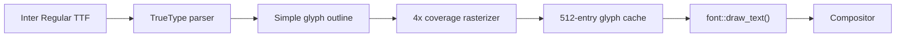

# NOTYVOS Font Subsystem

## Current status

**Phase 11 is delivered.** NOTYVOS now has a native scalable TrueType rasterizer using the bundled Inter family.

Delivered components:
- TrueType table parsing: head, hhea, hmtx, maxp, cmap formats 4 and 12, loca, glyf
- Simple glyph outline extraction
- Quadratic Bézier flattening
- 4× vertical supersampled coverage rasterization
- Per-face 512-entry age-based glyph cache
- `font::draw_text()` compositor integration
- Default Inter Regular face loading
- Boot self-test
- Anti-aliased Latin/Greek/Cyrillic text path

## Deferred font polish

- Multiple Inter weights/faces at runtime
- Kerning
- Complex-script shaping, including Arabic and Devanagari
- Subpixel horizontal rendering

## Font packaging

The repository contains the Inter family, including regular, italic and multiple weight/display variants. The runtime currently uses Inter Regular.

Inter is redistributed under the SIL Open Font License 1.1. See NOTICE, THIRD_PARTY_LICENSES/inter-font.txt and Fonts/README.md.


## Data flow

Quoted Mermaid is required so `font::draw_text()` is not parsed as class /
stadium syntax. Full pipeline: [`data flow.md`](data%20flow.md#phase-11--truetype-font-subsystem)
and [`diagrams/truetype.d2`](diagrams/truetype.d2).



```d2
direction: right
Inter -> Parser: TTF tables
Parser -> Outline: glyf + loca
Outline -> Raster: flatten Beziers
Raster -> Cache: coverage
Cache -> Draw: "font::draw_text()"
Draw -> Compositor
```

### Font subsystem map (Markmap source)

- TrueType / Inter
  - Delivered
    - Table parser
    - Simple outlines
    - 4x coverage rasterizer
    - Glyph cache
    - compositor draw_text
    - Boot self-test
  - Deferred
    - Multiple weights
    - Kerning
    - Complex-script shaping
    - Subpixel AA

## Next integration

Phase 12 uses the delivered font subsystem for Explorer 10G labels and controls.
