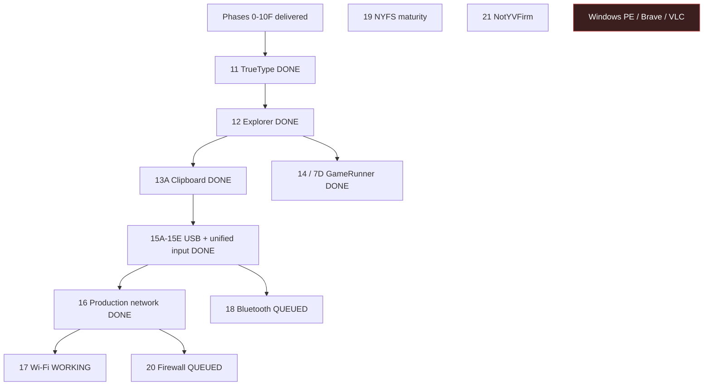

# NOTYVOS Roadmap

This is the canonical NOTYVOS roadmap. It supersedes the previous phase numbering.
Phases 0–10F and Phases 11–16 are completely delivered. Phase 17 is the active development milestone. Phases 18–21 remain queued. Windows .exe compatibility and Brave/VLC validation are explicitly excluded from the current queue.

## Roadmap map

Markmap source: [`diagrams/roadmap.markmap.md`](diagrams/roadmap.markmap.md).

- NOTYVOS roadmap
  - Delivered: 0–10F and Phases 11–16
  - Working: Phase 17 RTL8188EU Wi-Fi + Network Manager
  - Queued: Phases 18–21
  - Excluded: Windows PE, Brave, VLC

## Current state

| Subsystem | Status | Approx. | Reality |
|---|---|---:|---|
| Kernel boot / GDT / IDT / TSS / SMP / syscalls | Delivered | ~92% | Production networking, firewall and later hardware expansion are tracked in later phases |
| Memory (PMM, VMM, heap, exec arena) | Delivered | ~95% | Solid |
| Scheduler / tasks / fork / signals | Delivered | ~85% | Missing priorities, CPU affinity and real IPC |
| VFS / NYFS / initramfs | Delivered | ~55% | NYFS is development-grade; no journaling or recovery |
| Graphics (compositor, HAL, VBE, GPU API) | Delivered | ~85% | Solid for software rendering |
| RSX compatibility | Delivered | ~65% | FIFO, methods, raster, texture, UV, mip and depth; shaders/full method coverage remain |
| PPU / SPU / DMA / JIT | Delivered | ~70% | Working interpreter and baseline JIT; broader opcode coverage remains |
| PS3 ABI / cellFs / GameRunner | Delivered | ~70% | 7D runtime integration is delivered; broader PS3 compatibility coverage remains |
| Desktop UI | Delivered | ~85% | Core Explorer, file operations, clipboard and dialogs are delivered; polish remains |
| Image decoders | Delivered | ~90% | BMP/PNG/GIF/ICO/JPEG are solid |
| SVG decoder + icons | Delivered | ~85% | Diagnostics added; VFS packaging confirmation remains |
| TrueType font renderer | Delivered | ~75% | Inter rasterization and AA text delivered; shaping and kerning remain |
| Hardware support | Partial | ~45% | ACPI, AHCI, e1000, HDA, PS/2 and USB are delivered; RTL8188EU Wi-Fi is the active Phase 17 target |
| Native firmware (NotYVFirm) | Not started | 0% | Long-term firmware domain |
| Windows .exe compatibility | Excluded | 0% | Not on the current roadmap |
| Brave / VLC validation | Excluded | 0% | Not on the current roadmap |

## Frozen delivered boundary: Phases 0–10

All previously defined Phase 0–10 work is frozen as delivered, including desktop
polish through 10F, RSX work through 6F, rendering validation, image support,
themes, Appearance settings, snap layouts, taskbar groups, SVG icons and
Explorer navigation history.

Intentional Phase 2 gaps **2H** and **2J** remain absent.

## Phase 11 -- TrueType Font Subsystem -- DONE

Goal: scalable anti-aliased TrueType rendering using the Inter family.

| Subphase | Status | Scope |
|---|---|---|
| 11A | Done | TTF parser + outline extraction |
| 11B | Done | Coverage rasterizer |
| 11C | Done | Per-face glyph cache |
| 11D | Done | Compositor integration |
| 11E | Done | Boot self-test |

Delivered: head, hhea, hmtx, maxp, cmap 4/12, loca and glyf parsing; simple
glyph outlines; quadratic Bézier flattening; 4× vertical supersampling; 512-entry
age-based per-face cache; `font::draw_text()` integration; default Inter Regular
loading.

Deferred polish: multiple weights, kerning, complex-script shaping and subpixel
horizontal rendering.

## Phase 12 -- Explorer 10G + Real File Operations -- DONE

**Dependency:** Phase 11.

| Subphase | Status | Scope | Exit criteria |
|---|---|---|---|
| 12A | **Done** | Grid view + details toggle | Toolbar switches modes and remembers the session |
| 12B | **Done** | XP-style breadcrumb | Clickable path segments navigate to ancestors |
| 12C | **Done** | Real file operations | Open/New/Rename/Delete/Properties persist through VFS/NYFS |

12C will use/expose: `fs::vfs_create_file`, `fs::vfs_mkdir`,
`fs::vfs_rename`, `fs::vfs_unlink`, and `fs::vfs_write`.

Deferred from Phase 12: drag/drop, multi-select and Explorer search.

## Phase 13 -- Desktop Clipboard + Dialogs -- DONE

**Dependency:** Phase 12.

| Subphase | Scope |
|---|---|
| 13A | **Done** | Global clipboard, text/file lists, Ctrl+C/X/V routing |
| 13B | **Done** | Blocking input and confirmation dialogs |
| 13C | **Done** | Read-only Properties dialog with real metadata |

Deferred: rich-text clipboard, image clipboard and multi-item paste ordering.

## Phase 14 -- 7D GameRunner Runtime Integration -- DONE

**Dependency:** Phase 12.

| Subphase | Scope |
|---|---|
| 14A | **Done** | Session lifecycle: start/step/pause/resume/stop and dedicated task |
| 14B | **Done** | Persistent per-game configuration |
| 14C | **Done** | cellSaveData bridge to NYFS |

Universal save states remain deferred.

## Phase 15 -- USB Stack + USB HID -- DONE

| Subphase | Scope |
|---|---|
| 15A | **Done** | PCI enumeration + xHCI controller |
| 15B | **Done** | USB device enumeration |
| 15C | **Done** | USB HID keyboard/mouse |
| 15D | **Done** | USB mass storage |
| 15E | **Done** | Unified input facade and routing |

Deferred: hubs, USB 3.x SuperSpeed and isochronous transfers.

## Phase 16 -- Production Network Stack -- DONE

**Dependency:** Phase 15 optional.

| Subphase | Scope |
|---|---|
| 16A | **Done** | Ethernet, ARP and IPv4 |
| 16B | **Done** | ICMP and UDP |
| 16C | **Done** | TCP |
| 16D | **Done** | DHCP and DNS |
| 16E | **Done** | User-space socket API |

Deferred: IPv6, IPsec, multicast and raw sockets.

## Phase 17 -- Wi-Fi Driver + Management UI -- WORKING

**Dependency:** Phase 16. Phase 16 is completely delivered. The current active work is Phase 17.

| Subphase | Scope |
|---|---|
| 17A | **Working** | RTL8188EU 802.11 driver and `Firmware/rtl8188eufw.bin` firmware loading |
| 17B | **Working** | WPA2 supplicant |
| 17C | **Working** | Network Manager UI in Settings |
| 17D | **Working** | Roaming and power management |

Deferred: WPA3, 802.1X enterprise and monitor mode.

## Phase 18 -- Bluetooth Framework -- QUEUED

**Dependency:** Phase 15 optional.

| Subphase | Scope |
|---|---|
| 18A | HCI + USB transport |
| 18B | L2CAP + RFCOMM |
| 18C | Bluetooth HID |
| 18D | Pairing UI |

Deferred: BLE and audio profiles.

## Phase 19 -- NYFS Maturity -- QUEUED

| Subphase | Scope |
|---|---|
| 19A | Write-ahead journaling |
| 19B | Crash recovery |
| 19C | Dynamic directory/inode scaling |
| 19D | CRC32 block integrity and scrub |

Deferred: snapshots, deduplication, compression and ACLs.

## Phase 20 -- Firewall + Network Security -- QUEUED

**Dependency:** Phase 16.

| Subphase | Scope |
|---|---|
| 20A | Stateful IP/TCP packet filter |
| 20B | Per-application rules |
| 20C | Firewall UI in Settings |

Deferred: intrusion detection, deep packet inspection and VPN support.

## Phase 21 -- NotYVFirm -- QUEUED

Long-term native firmware domain replacing the Limine/UEFI boot dependency.

| Subphase | Scope |
|---|---|
| 21A | Firmware architecture specification |
| 21B | NotYVFirm UEFI boot path |
| 21C | Optional BIOS/legacy path |
| 21D | Firmware configuration UI |
| 21E | Signed updates and rollback |

Deferred indefinitely: Secure Boot integration and TPM measurements.

## Honest gap list

### Core OS
1. Wi-Fi driver polish and remaining RTL8188EU integration
2. Bluetooth framework
5. Firewall and network security
6. NYFS journaling, crash recovery and scaling
7. NotYVFirm

### Remaining desktop / UI polish
3. Multiple Inter font weight selection
4. Complex-script shaping and kerning
5. Application lifecycle polish

### Remaining PS3 / compatibility work
6. Full PS3 system-call coverage
7. Complete PPU opcode coverage
8. Complete SPU ecosystem coverage
9. Complete RSX method and shader-model coverage

## Explicit exclusions

- Windows PE loading, Win32/Win64 API surface, registry, COM and SEH
- Brave browser validation
- VLC media-player validation

These are not current roadmap phases.

## Delivery contract

Each phase delivery documents architecture, component purpose, dependencies,
file structure, data flow, implementation, build changes, tests, expected result,
limitations, next milestone and roadmap status.

Every subsystem gets a boot self-test. Warnings are errors, casts use
`static_cast`, magic numbers are avoided and dead code is not retained.

## Roadmap status

| Phase | Name | Status |
|---|---|---|
| 0–10F | Foundation through desktop polish | **Done** |
| 11 | TrueType Font Subsystem | **Done** |
| 12 | Explorer 10G + Real File Operations | **Done** |
| 13A | Desktop Clipboard | **Done** |
| 13 | Desktop Clipboard + Dialogs | **Done** |
| Fix | User-fault isolation + user build flags + BMP test vector | **Delivered** |
| 14 / 7D | GameRunner Runtime Integration | **Done** |
| 15A–15E | USB Stack + Unified Input | **Done** |
| 16 | Production Network Stack | **Done** |
| 17 | Wi-Fi Driver + Management UI | **Working** |
| 18 | Bluetooth Framework | Queued |
| 19 | NYFS Maturity | Queued |
| 20 | Firewall + Network Security | Queued |
| 21 | NotYVFirm | Queued |
| -- | Windows .exe compatibility | **Excluded** |
| -- | Brave / VLC validation | **Excluded** |

**Current active delivery: Phase 17 RTL8188EU Wi-Fi + Network Manager.**

The delivered ISR exception-dispatch fix is commit `ef79fc3f31e0c6f1574cb2e29028ce4e91dcdb1b`. Kernel-mode exceptions remain fatal; user-mode exceptions are isolated to the offending task through the scheduler exit path.
