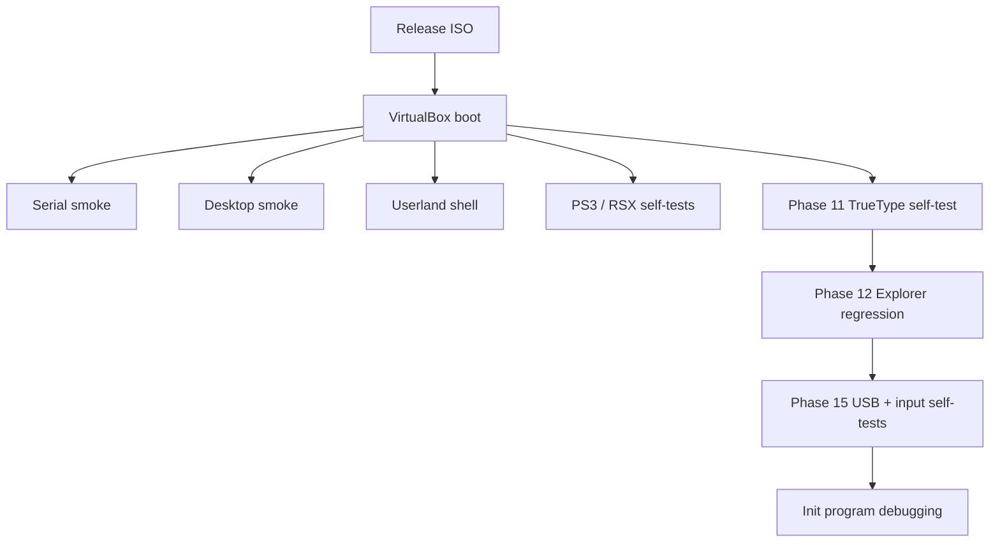

# Testing

## Test flow

## Current test environment

The documented development target is VirtualBox. QEMU is not the current
runtime test workflow.

Use:

    tools\scripts\vbox-run.cmd

after a Release build.

## Boot smoke test

A successful boot should show the kernel banner and initialization logs on
the serial console, then reach the desktop and start init.elf.

Look for messages covering:
- NOTYVOS version
- memory map and HHDM initialization
- ACPI initialization
- AHCI/block initialization
- RTL8188EU Wi-Fi firmware presence when Wi-Fi hardware testing is enabled
- NYFS mount or format
- VFS/initramfs mount
- graphics backend registration
- PS3 runtime self-tests
- RSX command/rasterizer/UV/perspective/mipmap validation
- GameRunner format detection and bounded guest launch
- BMP/PNG/GIF/ICO/JPEG decoder and Image Viewer validation
- Theme-state, shortcut and Settings Appearance validation
- Alt-Tab, minimize/restore, Alt+F4, taskbar hover, toasts and snap-layout validation
- Taskbar grouping and Explorer navigation history validation
- SVG icon loading diagnostics and serial capture/restart input validation
- scheduler start
- user init

## Userland smoke test

At the shell prompt:

    help
    about
    ls /
    ls /disk
    cat /readme.txt
    echo hello
    pid
    fork
    time
    sleep 100
    brk
    write test hello
    ls /disk
    cat /disk/test
    rm test
    ls /disk

The fork command creates a child and exercises parent waiting/reaping.
The write command creates/writes a persistent NYFS file under /disk.

Use Ctrl+C to exercise the current SIGINT path. The exit command does not
shut down the system because the shell is the init process.

## Desktop smoke test

Verify:
- desktop background or wallpaper is visible
- taskbar and Start menu render
- desktop shortcuts respond to the mouse
- Explorer opens and lists VFS entries
- Settings tabs respond
- Bin window renders
- windows can be focused and dragged
- minimize/maximize/close controls behave as implemented
- context menu opens
- PS/2 mouse movement and wheel input work

## Storage test

The kernel performs a small read/write verification against the last sector
of the first available writable block device during boot. This is a
development smoke test only.

NYFS is then mounted on that device. The current implementation formats a
device when a valid NYFS superblock is not present.

Do not treat NYFS as a mature filesystem. It currently has a fixed metadata
layout and does not provide journaling, crash recovery or a general block
allocator.

## PS3 runtime self-tests

Boot runs:
- PowerPC decoder recognition
- PS3 ELF header parsing
- PPU execution
- SPU execution and mailbox FIFO behavior
- DMA main/local transfers and barriers
- baseline JIT self-test

A self-test log entry marked Warn indicates that the relevant test did not
match its expected result.

## Phase 5 verification

Phase 5A through 5D is delivered. Boot testing should cover the completed
baseline JIT, memory/control-flow translation, FPU/VMX translation, block
chaining, cache invalidation and self-modifying-code handling.

## Regression rule

When a subsystem changes, test the boot path first, then its direct userland
or desktop behavior, followed by the relevant runtime self-tests.

## Current roadmap validation

The frozen delivered boundary is **Phases 0–10F**.

Phase 11 validation covers Inter TTF parsing, simple glyph outlines, anti-aliased coverage rasterization, glyph caching, compositor text drawing and the boot self-test.

Phase 12 Explorer validation is delivered, including grid/details, breadcrumb navigation and real file operations. Phase 13A clipboard and Phase 15A–15E USB + unified input are delivered. The next active regression target is **init-program debugging**. Phase 14 / 7D and later networking, Bluetooth, NYFS, firewall and NotYVFirm work remain queued. Wi-Fi firmware input is now defined as `Firmware/rtl8188eufw.bin`, while full RTL8188EU integration remains a Phase 17 target.

Windows PE/Win32 compatibility and Brave/VLC validation are excluded and are not test targets.
